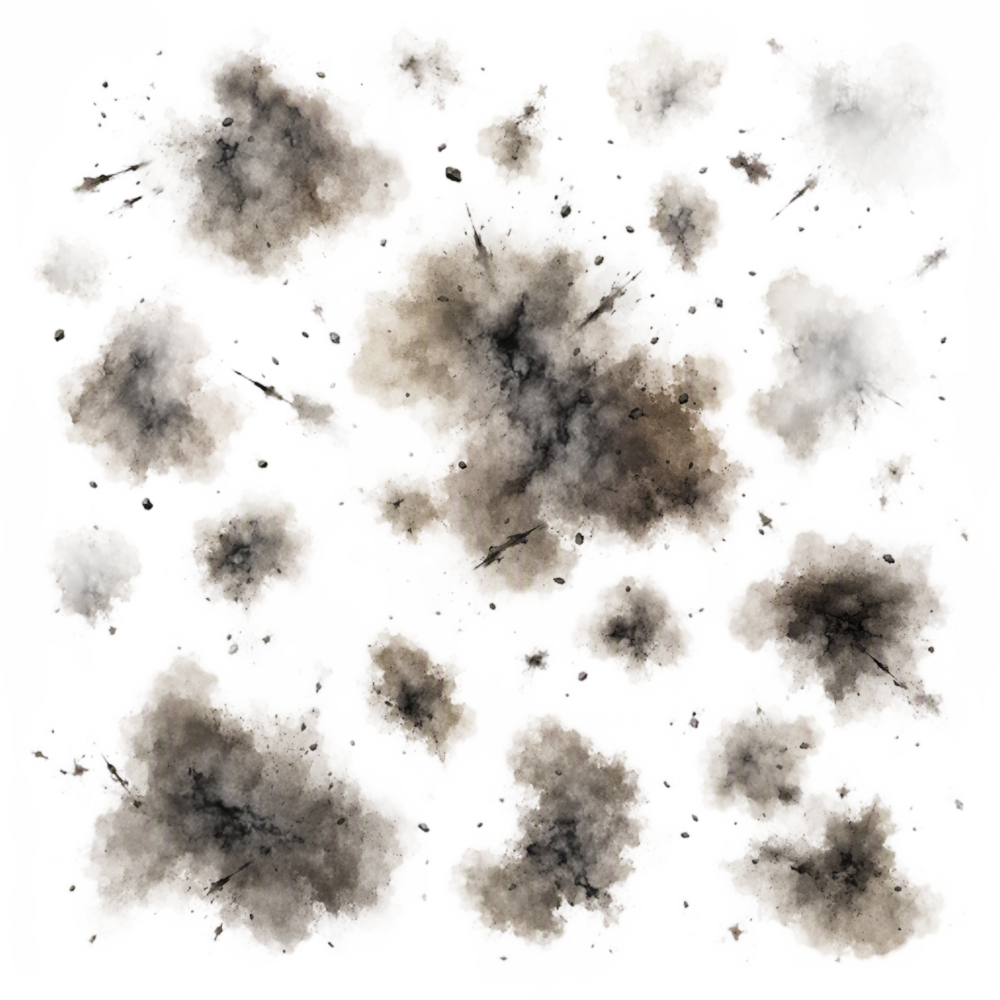

# 灰头土脸贴花效果设计方案（三渲二）

> 适用项目：别抢我镜头（MyGame / Godot 4.x）
> 涉及文件：`scripts/player/character_effects.gd`
> 新增资源：`assets/textures/fx/dirt_soot.png`
> 日期：2026-08-22

## 一、资源交付

| 资源 | 命名 | 路径 |
|---|---|---|
| 烟熏灰斑贴花（透明 PNG） | `dirt_soot.png` | `res://assets/textures/fx/dirt_soot.png` |



## 二、现状问题诊断

当前 `apply_dirt_decal()` 用 FastNoiseLite cellular 噪声程序生成贴花，存在 4 个问题：

| # | 问题 | 现状 | 后果 |
|---|---|---|---|
| 1 | 纹理形态 | 细胞状噪声（`TYPE_CELLULAR`） | 像「斑点」不像「烟熏」，且过于规则 |
| 2 | cull_mask | `0xFFFFF`（全 20 层） | 脏污会糊到地面 / 墙体 / 其他玩家 |
| 3 | 颜色过深 | `modulate=Color(0.32,0.30,0.27)` + `albedo_mix=1.0` | 角色糊成炭黑，肤色轮廓丢失 |
| 4 | 无 normal_fade | 默认 0 | 脸 / 肩等曲面贴花被拉伸变形 |

## 三、应用方案

### 3.1 替换贴花纹理

删除程序噪声生成，改为 preload 手绘贴花：

```gdscript
static var _dirt_texture: Texture2D

static func _get_dirt_texture() -> Texture2D:
	if _dirt_texture == null:
		_dirt_texture = preload("res://assets/textures/fx/dirt_soot.png")
	return _dirt_texture
```

### 3.2 改造 apply_dirt_decal

```gdscript
func apply_dirt_decal(duration: float = 6.0) -> void:
	if not character_root:
		return
	var decal := Decal.new()
	decal.texture_albedo = _get_dirt_texture()
	decal.size = Vector3(1.6, 2.0, 1.6)            # 高度略降，底部不碰地面
	decal.modulate = Color(0.62, 0.56, 0.50)       # 中灰棕，保留肤色轮廓
	decal.albedo_mix = 0.7                         # 不 100% 覆盖
	decal.normal_fade = 0.35                       # 曲面不拉伸
	decal.cull_mask = DIRT_DECAL_CULL_MASK         # 仅投影玩家层
	character_root.add_child(decal)
	decal.position = Vector3(0.0, 1.0, 0.0)
	var tw := create_tween()
	tw.tween_interval(maxf(duration - 1.0, 0.0))   # 去掉原冗余的 0 秒 tween
	tw.tween_property(decal, "modulate:a", 0.0, 1.0)
	tw.tween_callback(decal.queue_free)
	effect_started.emit("dirt")
```

### 3.3 cull_mask 修正（必做）

`Decal.cull_mask` 对应渲染层（VisualInstance3D.layers）。玩家 mesh 与地面目前都默认在 Layer 1，所以全层 `0xFFFFF` 必然糊到地面。

**方案 A（推荐，最干净）—— 玩家模型单独一个渲染层**

1. 编辑器选中 player.tscn 里的角色模型 MeshInstance3D（身体各部位），`Visibility > Layers` 只勾 **Layer 3**（取消 Layer 1）。
2. 定义常量：`const DIRT_DECAL_CULL_MASK := 4  # 1 << 2，即 Layer 3`
3. 效果：贴花只投到玩家身体，绝不糊地面 / 别人；后续「只影响玩家」的特效都能复用该层。

**方案 B（不动层）—— 抬高贴花底部**

- 保持 `cull_mask = 0xFFFFF`，但 `size = Vector3(1.6, 1.8, 1.6)`、`position.y = 1.05`，底部离地约 0.15m，不碰地面（代价：脚 / 小腿贴不到）。

## 四、三渲二适配要点

1. **描边天然保留**：Decal 只改 albedo，不覆盖角色 outline / inverted hull，三渲二轮廓线不会丢。
2. **颜色用中灰棕而非纯黑**：`0.62 / 0.56 / 0.50` 保留肤色明暗层次，符合「色块分明、不糊成一团」。
3. **贴花边缘偏块状**：手绘烟熏斑块边界比柔边更「卡通硬化」，叠上去更有漫画爆炸感。

## 五、变更清单

- [ ] 新增 `assets/textures/fx/dirt_soot.png`（已完成，透明背景烟熏贴花）
- [ ] `character_effects.gd` 替换 `_get_dirt_texture()` 为 preload
- [ ] `character_effects.gd` 改造 `apply_dirt_decal()`（modulate / albedo_mix / normal_fade / cull_mask）
- [ ] 玩家模型设置独立渲染层（方案 A，编辑器勾 Layer 3）
